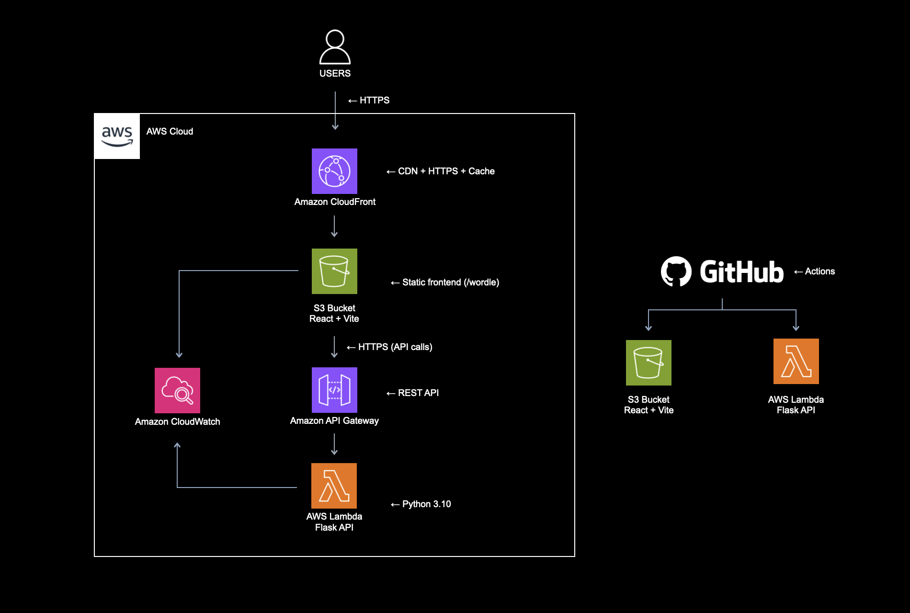

# Wordle ES – DevOps Portfolio Project

This project is part of my DevOps portfolio and focuses on designing, deploying, and operating a real-world cloud architecture with full CI/CD automation using AWS and GitHub Actions.

The application is a Spanish Wordle game composed of:
	•	A React + Vite frontend deployed as a static website
	•	A Python Flask backend deployed as a serverless API

The primary goal of this project is learning and showcasing DevOps practices, infrastructure decisions, and CI/CD workflows — not just making the application work.

---

## 🧱 Architecture (Current State)

```
User
 ↓
Browser
 ↓
CloudFront (HTTPS)
 ↓
AWS S3 (Static Website Hosting)
 ↓
React + Vite Frontend
 ↓
HTTPS (REST)
 ↓
AWS API Gateway
 ↓
AWS Lambda (Python 3.10)
 ↓
Flask API (Game logic)
```

---

## 🖼️ Architecture Diagram



---

## 🛠 Tech Stack

### Frontend
- React 18
- Vite
- Tailwind CSS
- AWS S3 (static hosting)
- AWS CloudFront (CDN + HTTPS)

### Backend
- Python 3.10
- Flask (WSGI)
- AWS Lambda
- AWS API Gateway (REST)

### DevOps / Cloud
- AWS S3
- AWS CloudFront
- AWS Lambda
- AWS API Gateway
- Serverless Framework (v3)
- GitHub Actions (CI/CD)
- AWS IAM (least-privilege credentials)

---

## 🔍 Key DevOps Decisions

### Static Frontend Deployment
The frontend is deployed as a static site to:
- Reduce operational complexity
- Minimize infrastructure cost
- Improve scalability and performance
- Fully decouple frontend and backend deployments

This approach fits naturally with **S3 + CloudFront** and enables fast, reliable CI/CD pipelines.

---

### Serverless Backend Architecture
The backend is deployed using **AWS Lambda + API Gateway**, which provides:
- Automatic scaling
- Pay-per-request pricing
- No server management
- Clear separation between application logic and infrastructure

---

### Flask without Mangum
Flask is a **WSGI** framework.  
Instead of using Mangum (ASGI adapter), the backend uses a **custom Lambda handler** to:

- Maintain full control over the request lifecycle
- Avoid runtime and adapter incompatibilities
- Simplify debugging in AWS Lambda
- Better understand API Gateway → Lambda integration

This mirrors how many production Flask APIs are deployed in serverless environments.

---

## 🚀 CI/CD Pipelines

### Backend Pipeline
Triggered on changes to `/backend`:

1. Install Node.js and Python dependencies
2. Install Serverless Framework and plugins locally
3. Package Flask application
4. Deploy to AWS Lambda using Serverless Framework
5. Update API Gateway endpoint automatically

### Frontend Pipeline
Triggered on changes to `/front`:

1. Install frontend dependencies
2. Build static assets with Vite
3. Upload build artifacts to S3 (`/wordle`)
4. Invalidate CloudFront cache to ensure immediate updates

Both pipelines are fully automated and run via **GitHub Actions**.

---

## 🔐 Secrets Management

- AWS credentials are stored securely using **GitHub Actions Secrets**
- No secrets are committed to the repository
- Environment-specific values are injected at build time

---

## 🧪 Validation & Debugging

- Backend tested using `curl` and browser requests
- CloudWatch Logs used extensively for runtime debugging
- End-to-end validation performed:
  - CloudFront → S3 → Frontend → API Gateway → Lambda → Flask

Several real-world issues were identified and resolved, including:
- Serverless framework version mismatches
- Plugin availability in CI environments
- CORS configuration issues
- API Gateway integration errors
- Packaging and dependency resolution problems

---

## 🌐 Live Deployment

- Frontend available via custom domain and CloudFront  
- Backend exposed via HTTPS API Gateway endpoint  
- Frontend and backend fully integrated in production  

---

## 📌 Current Status

✅ Frontend deployed via S3 + CloudFront  
✅ Backend deployed via Lambda + API Gateway  
✅ CI/CD pipelines fully operational  
✅ Dev / Prod environments separated  
✅ Custom domain configured with HTTPS  

---

## 🧠 Learning Outcomes

- Designing cloud-native architectures
- Building reproducible CI/CD pipelines
- Applying Infrastructure as Code principles
- Managing secrets securely
- Debugging real serverless production issues
- Making informed architectural trade-offs
- Communicating technical decisions clearly

---

## 🔜 Possible Next Enhancements

- Add observability (structured logs, metrics)
- Improve frontend state handling
- Introduce backend persistence (DynamoDB)
- Add automated tests to pipelines
- Implement blue/green or canary deployments

---

## 🌱 Environment Separation

This project follows a basic environment separation strategy to reduce risk and improve deployment safety.

### Environments

- **dev**
  - Used for development and testing
  - Backend deployed to a separate API Gateway and Lambda
  - Allows faster iteration and debugging

- **prod**
  - Used for production traffic
  - Stable API endpoints
  - Protected by branch rules and release process

### Environment control

- Backend deployments are controlled via Serverless Framework stages
- Frontend environment is configured via build-time environment variables
- GitHub Environments manage secrets and deployment context

This approach mirrors real-world DevOps practices while remaining lightweight and cost-effective.

---

## 🔖 Versioning & Releases

This project follows **Semantic Versioning (SemVer)**:

- **MAJOR** – Breaking changes
- **MINOR** – Backward-compatible features
- **PATCH** – Bug fixes and small improvements

Releases are created from the `main` branch and represent stable, production-ready versions of the application.
